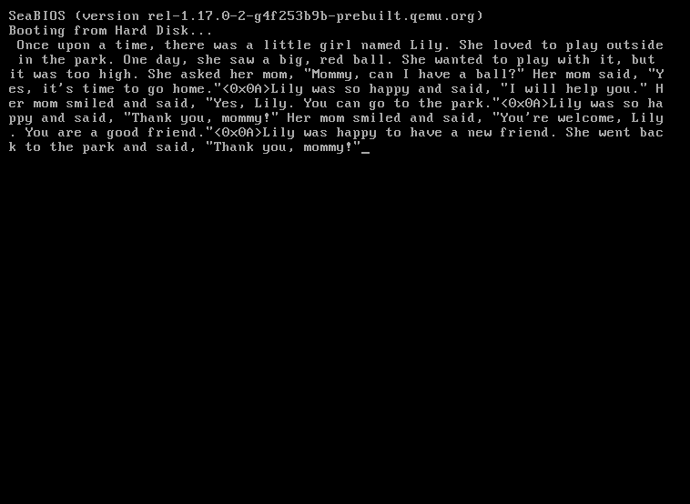

# sectorllm
>  The world's smallest llama2 inference engine

A complete Llama2 inference engine that fits in 1369 bytes of x86 real mode assembly. 
It boots directly from disk, loads a quantized model, and generates text before any operating system loads.



It can run the [stories260K](https://huggingface.co/karpathy/tinyllamas/blob/main/stories260K/readme.md) model, a tiny model trained on children's stories, with 260K parameters across 5 layers, 8 attention heads, and a vocabulary of 512 tokens.

## Running
```
./download.sh && python3 quantize.py && make run
```


## How it works

The boot sector loads the model data from disk into high memory, then runs a full transformer forward pass for each token.

A python script (`quantize.py`) packs the model into a custom binary format designed for minimal decoding overhead, Weights are quantized to int8 with a global absmax scale, lookup tables for `exp` and `silu` are precomputed and embedded directly, and the Q/K/V and gate/up weight matrices are fused so the assembly can issue a single matmul call rather than three.

The KV cache is quantized to int8 at runtime with a per-token scale stored in a separate buffer, keeping the cache small enough to fit in the available segment space for the full 512-token context.

Sampling is done only via greedy argmax at the moment. There should be enough space for a fancier sampling technique, but the goal was to minimize space.

## Limitations
1. The code is written to be as golfed as possible, therefore performance and precision are not optimal.
2. The model architecture and prompt are hardcoded.

It could technically be possible to modify this to load a larger model (like stories15M), but this would require switching to protected mode (or possibly unreal mode).

## Contributing
If you are an assembly god and can find a way to shrink the binary size, please contribute!
The goal is to show what is possible in the least amount of bytes possible without cheating.
Don't forget to add your name to the code ;)